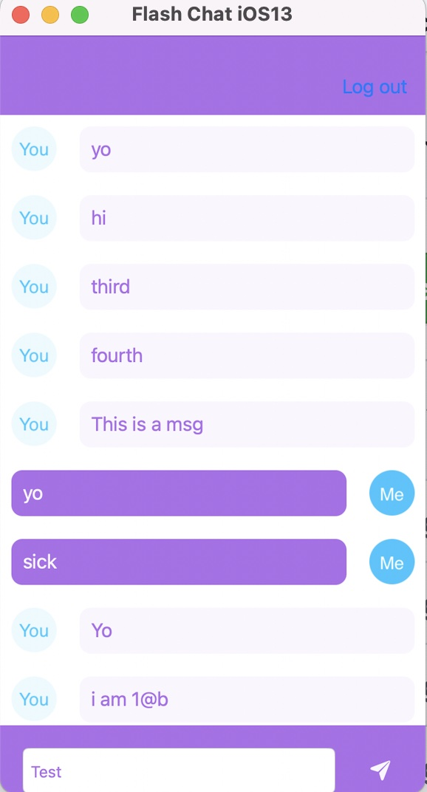
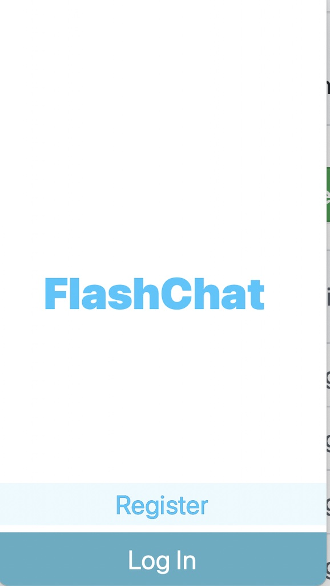
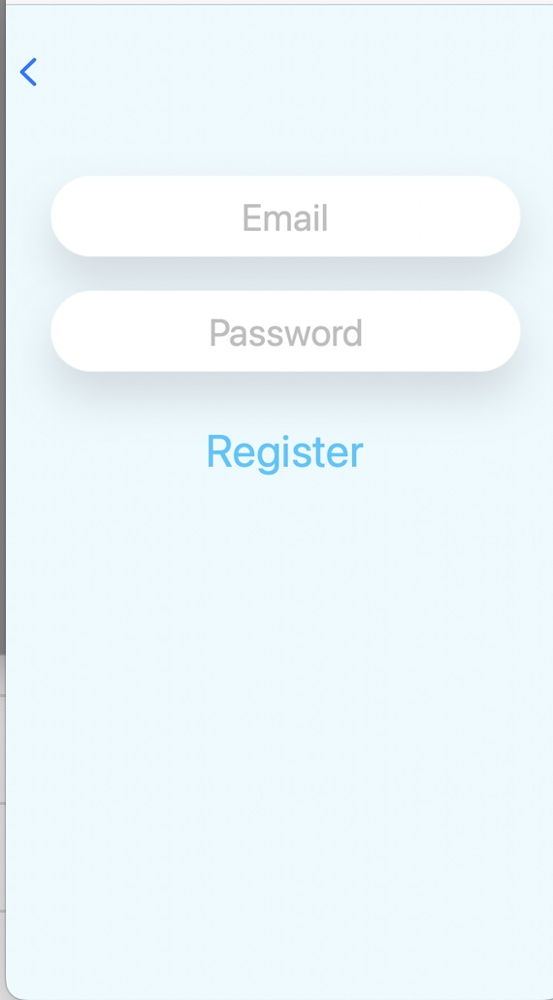
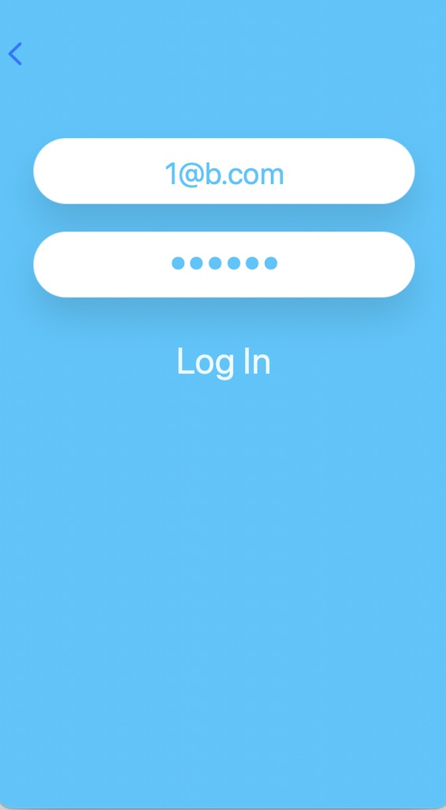

# iOS Chat

A basic iOS chatting app using Firebase Authentication and Firestore

## Build
### Firebase
Before you can actually use the app you'll need to setup some resources in Firebase
- A Firebase project and obtained the Google Services `.plist`
- A FireStore database for use to store the messages
- Read/Write ability for either users that are logged in or just in test

## Course
See iOS 13 Developer Bootcamp Udemy course by Angela Yu: https://www.udemy.com/course/ios-13-app-development-bootcamp/
